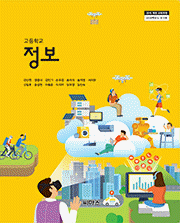

<body>

 

2020 로딩중학교 1학년
 

정보  Informatics

 

Notice

&nbsp;

# Textbook [<a href="http://edpia.net/info/_textbook/table%20of%20contents.pdf">차례</a>] [<a href="http://edpia.net/info/_textbook/unit%201.pdf">1단원</a>] [<a href="http://edpia.net/info/_textbook/unit%202.pdf">2단원</a>] [<a href="http://edpia.net/info/_textbook/unit%203.pdf">3단원</a>] [<a href="http://edpia.net/info/_textbook/unit%204.pdf">4단원</a>]

고등학교 정보 (강신천 외 12인 | 씨마스 | 2018년 3월)

<!--

# 1학기 기말고사  학습자료

<a href="materials/final_1/1-1_.pdf">Ⅰ-1. 정보 사회</a>

<a href="materials/final_1/2-1_.pdf">Ⅱ-1. 자료와 정보의 표현</a>

<a href="materials/final_1/3-2_.pdf">Ⅲ-2-1. 알고리즘 설계</a>

<a href="materials/final_1/3-scratch_.pdf">스크래치 프로그래밍</a>

# 2학기 기말고사  학습자료

<a href="materials/final_2/_1-2.pdf">Ⅰ-2. 정보 윤리</a>

<a href="materials/final_2/_3-2.pdf">Ⅲ-2-2. 알고리즘 분석</a>

<a href="materials/final_2/_3-3.pdf">Ⅲ-3. 프로그래밍</a>

-->

# <a href="http://edpia.net/info/materials/pa12.ppsx">1학기 수행평가 학습자료</a>
[<a href="http://edpia.net/info/materials/pa12.pdf">PDF</a>]

① Ⅰ-1. 정보 사회

② Ⅰ-2. 정보 윤리

# <a href="https://pds.joins.com/news/component/htmlphoto_mmdata/200707/htm_20070711141535c000c010-001.JPG">1학기 기말고사  학습자료</a> [<a href="http://edpia.net/info/materials/final1.pdf">PDF</a>]

☞ 객관식 20문항 출제

# PDF 파일 인쇄 시, A4 1면에 4쪽씩 출력하는 방법

- <a href="http://edpia.net/info/img/page_handling-ie.png">아크로뱃리더에서 출력할 때</a>

- <a href="http://edpia.net/info/img/page_handling-chrome.png">크롬에서 출력할 때</a>

# CODE.ORG <a href="http://edpia.net/info/manual/login.pdf">로그인 방법</a> 및 <a href="http://edpia.net/info/manual/certificate.pdf">수료증 제출 방법</a>

# SW교육 관련 영상: <a href="https://www.youtube.com/playlist?list=PLUxmkY6_fjUZdRCM7XDsAjI56vs4DG4-8" target="_blank">코딩, 소프트웨어 시대: 12가지 코딩 이야기</a>

/ 조용한 혁명 / 10초 / 생명을 구하는 문자 / 어렵지 않은 이야기, 코딩이란?

/ 21세기 갈릴레오 / 24시간 해커톤 / 에스토니안 마피아 / 잭의 컴퓨터

/ 직업의 미래 / 당신이 만나게 될 예술가 / 힐링 대화명 / 어떤 사람

 

Software

&nbsp;

# <a href="http://edpia.net/info/program/cortona3d-viewer-32bit.msi">Cortona3D Viewer</a> (<a href="http://www.cortona3d.com/en/cortona3d-viewer" target="_blank">cortona3d.com</a>)

# <a href="http://edpia.net/info/program/HxDkor.zip">HxD</a> (<a href="https://mh-nexus.de/en/downloads.php?product=HxD" target="_blank">mh-nexus.de</a>)

# <a href="http://edpia.net/info/program/midiplayer_57.zip">Midi Player 5.7</a>

# <a href="http://edpia.net/info/program/Scratch-461.exe">Scratch 2 Offline Editor</a> (<a href="https://scratch.mit.edu/download" target="_blank">scratch.mit.edu</a>)

# <a href="http://edpia.net/info/program/python-3.7.0.exe">Python 3.7.0</a> (<a href="https://www.python.org/downloads/">www.python.org</a>)

# <a href="http://edpia.net/info/program/Dev-Cpp%205.11%20TDM-GCC%204.9.2%20Setup.exe">Dev-C++ 5.11</a> (<a href="http://orwelldevcpp.blogspot.kr/" target="_blank">orwelldevcpp.blogspot.kr</a>)

# <a href="http://ai2.appinventor.mit.edu/">App Inventor 2</a> (<a href="http://appinventor.mit.edu/" target="_blank">appinventor.mit.edu</a>)

 

Materials

&nbsp;

I 정보 문화

1. <a href="http://edpia.net/info/materials/1-1.ppsx">정보 사회</a> [<a href="http://edpia.net/info/materials/1-1.pdf">PDF</a>]

1-1 정보 사회와 정보 과학

1-2 정보 과학 분야의 직업과 진로

2. <a href="http://edpia.net/info/materials/1-2.ppsx">정보 윤리</a> [<a href="http://edpia.net/info/materials/1-2.pdf">PDF</a>]

2-1 정보 보호와 공유

2-2 정보 보안

2-3 저작권 활용

2-4 사이버 윤리

&nbsp;

II 자료와 정보

1. 자료와 정보의 표현

1-0 <a href="http://edpia.net/info/materials/2-1-0.ppsx">수치의 효율적 디지털 표현</a>  [<a href="http://edpia.net/info/materials/2-1-0.pdf">PDF</a>] [<a href="http://edpia.net/info/materials/2-1-0.mp4">영상</a>]

1-1 문자의 효율적인 디지털 표현

1-2 그림의 효율적인 디지털 표현

1-3 소리의 효율적인 디지털 표현

2. 자료와 정보의 분석

2-1 자료 처리와 컴퓨팅 기술

2-2 자료의 수집과 분석

2-3 정보의 관리

&nbsp;

III 문제 해결과 프로그래밍

1. 추상화

2. 알고리즘

2-1 알고리즘 설계

2-2 알고리즘 분석

3. 프로그래밍

3-1 프로그래밍 환경

3-2 변수와 자료형

3-3 연산자

3-4 표준입출력과 파일입출력

3-5 제어 구조의 활용

3-6 배열의 활용 (스크래치 프로그래밍)

3-7 함수의 활용

■ 스크래치 프로그래밍

1 제어 구조의 활용

2 배열의 활용

■ CODE.ORG

1 마인크래프트

2 겨울왕국

■ 모바일 프로그래밍

1 모바일 앱 환경과 기술

2 앱 인벤터(App Inventor)

3 앱 만들기

&nbsp;

IV 컴퓨팅 시스템

1. 컴퓨팅 시스템의 동작 원리

2. 피지컬 컴퓨팅

 

Source Code

&nbsp;

VRML

1. <a href="http://edpia.net/info/source_code/vrml/vrmltest.wrl">3D Primitives and Color</a>

2. <a href="http://edpia.net/info/source_code/vrml/elevator.wrl">Animation and Triggers</a>

&nbsp;

Scratch

1. 선택 구조: <a href="http://edpia.net/info/source_code/scratch/ex01-selective.sb2">비만도 측정</a>

2. 반복 구조: <a href="http://edpia.net/info/source_code/scratch/multiplication_table.sb2">구구단</a>, <a href="http://edpia.net/info/source_code/scratch/ex02-iteration.sb2">쥐잡기 게임</a>

3. 배열: <a href="http://edpia.net/info/source_code/scratch/ex03-array1.sb2">총점 계산(순차)</a>,  <a href="http://edpia.net/info/source_code/scratch/ex03-array2.sb2">총점 계산(반복)</a>

&nbsp;

Python

1. 반복 구조: <a href="http://edpia.net/info/source_code/python/regular_hexagon.py">정육각형 그리기</a>

2. 연산자: <a href="http://edpia.net/info/source_code/python/number_of_bills.py">최소 지폐 개수 구하기</a>

&nbsp;

C

1. 정렬 알고리즘: <a href="http://edpia.net/info/source_code/c/bubble.c">버블 정렬</a>, <a href="http://edpia.net/info/source_code/c/bubble2.c">버블 정렬2</a>, <a href="http://edpia.net/info/source_code/c/selection.c">선택 정렬</a>

2. 탐색 알고리즘: <a href="http://edpia.net/info/source_code/c/sequential.c">순차 탐색</a>,  <a href="http://edpia.net/info/source_code/c/binary.c">이진 탐색</a>

&nbsp;

App Inventor

1. <a href="http://edpia.net/info/source_code/ai/Calculator.aia">계산기</a>

2. <a href="http://edpia.net/info/source_code/ai/Cat.aia">고양이</a>

&nbsp;

CODE.ORG

1. <a href="https://studio.code.org/s/mc" target="_blank">마인크래프트</a>

2. <a href="https://studio.code.org/s/frozen" target="_blank">겨울왕국</a>

 

Etcetera

&nbsp;

# <a href="http://edpia.net/info/example/Kia%20K5%20(Optima)%202013%20pre-launch%20commercial%20(korea).mp4">모스 부호가 사용된 자동차 광고</a>

# <a href="http://edpia.net/info/example/encoding_example.zip">문자 인코딩 방식 비교</a>

# <a href="http://edpia.net/info/example/%EB%B9%84%ED%8A%B8%EB%A7%B5%ED%99%95%EB%8C%80.xlsx">비트맵 이미지 확대 시 품질이 저하되는 원리</a>

# <a href="http://edpia.net/info/example/elsa.zip">그림 자료 비교</a>, <a href="http://edpia.net/info/example/butterfly.zip">소리 자료 비교</a>, <a href="http://edpia.net/info/example/xiao3.zip">영상 자료 비교</a>

# <a href="http://edpia.net/info/example/%EC%8B%9C%EA%B0%84%EB%B3%B5%EC%9E%A1%EB%8F%84.xlsx">시간복잡도 크기 비교</a>

 

</body></html>
